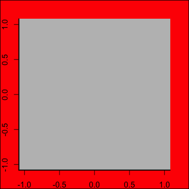
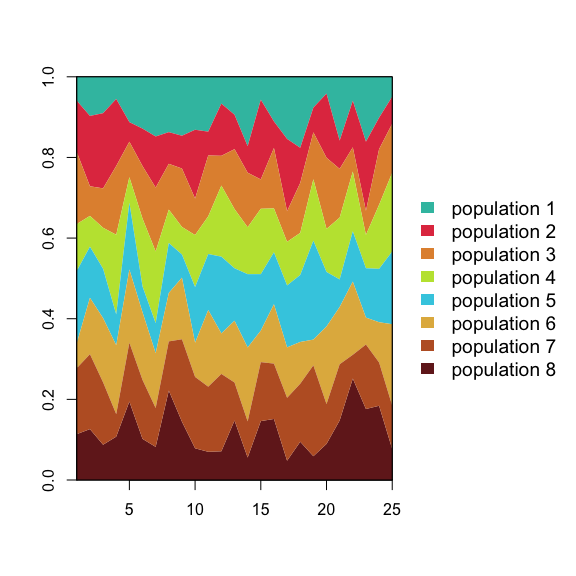
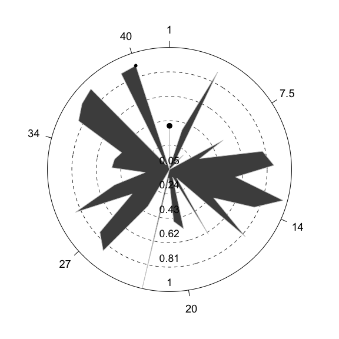
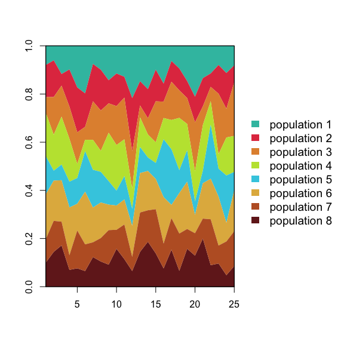
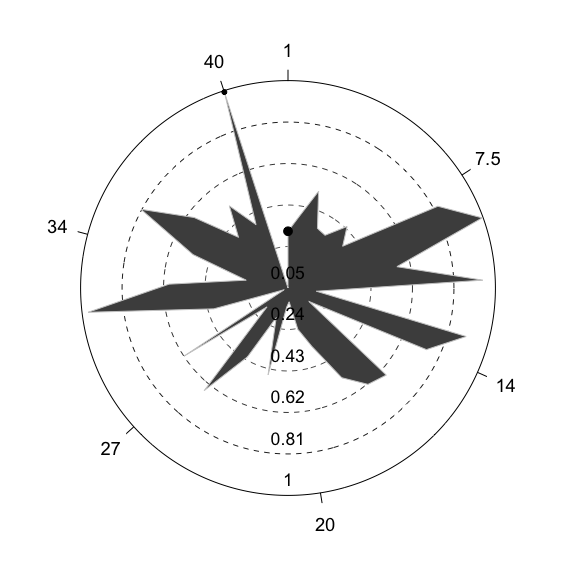
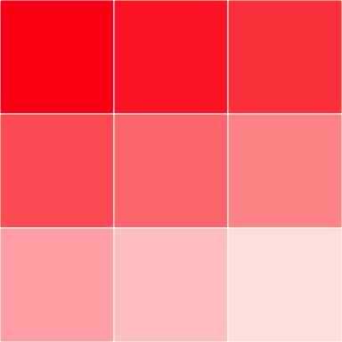

Last 'README' update: 27 mai 2016

Travis: [](https://travis-ci.org/KevCaz/graphicsutils)

Description
===========

*graphicsutils* is an R package that includes a set of graphical functions. As the [*plotrix*](http://cran.r-project.org/web/packages/plotrix/index.html) package, it adds several graphics utilities based on the core package *graphics*. Note that this package is not intended to be sumitted to the CRAN. First, because many of these functions already exist in other packages (in a different form though). Second, because I use it to improve my coding skill and my experience in writing a R package. This allows me to make some functions disappearing without me explaining why! Nevertheless, this package may help users to deal with typical issues they may encounter when using *graphics*. If some of these functions turn out to be really helpful then they will likely appear in a different package which will be submitted to the CRAN. Also, *graphicsutils* is not intended to be used with [ggplot2](http://cran.r-project.org/web/packages/ggplot2/index.html) package.

Install
=======

To install the package, use the [*devtools*](http://cran.r-project.org/web/packages/devtools/index.html) package.

``` r
install.packages("devtools")
devtools::install_github("KevCaz/graphicsutils")
```

Then, load it:

``` r
library(graphicsutils)
```

Main features
=============

Empty your plot
---------------

To start a figure from scratch it is often useful to get a plot without nothing but the correct size of axes. `plot0()` allows the user to do so :

``` r
plot0(c(0,1),c(0,1))
```

<!-- -->

Empty isn't it? Also, it can be filled with a given color using `fill` parameter.

``` r
plot0(c(0,1),c(0,1), fill="lightskyblue1")
```

<!-- -->

Add a box
---------

Box allows the user to add any axes around the plot.

``` r
par(mar=rep(2,4))
plot0()
box2(which="figure", lwd=2, fill="grey30")
box2(side=12, lwd=2, fill="grey80")
axis(1)
axis(2)
```

<!-- -->

A stacked areas chart
---------------------

### A simple stacked areas

``` r
plot0(c(0,10),c(0,10))
sz <- 100
seqx <- seq(0, 10, length.out=sz)
seqy1 <- 0.2*seqx*runif(sz, 0, 1)
seqy2 <- 4+0.25*seqx*runif(sz, 0, 1)
seqy3 <- 8+0.25*seqx*runif(sz, 0, 1)
envelop(seqx, seqy1, seqy2, col="grey85", border=NA)
```

<!-- -->

### A complete stacked areas

``` r
x <- data.frame(matrix(runif(200,2,10), 8, 25))
stackedAreas(x)
```

<!-- -->

Polar plot
----------

``` r
polarPlot(1:40, stats::runif(40), to=1.9*pi, col="grey30", border="grey80")
```

<!-- -->

Get pretty ranges
-----------------

``` r
vec <- stats::runif(20)
range(vec)
#> [1] 0.001531836 0.930422110
prettyRange(vec)
#> [1] 0.00 0.95
prettyRange(c(3.85,3.88245))
#> [1] 3.850 3.885
```

Interactive functions
---------------------

Some functions are interactive and fairly understandable! So, I suggest you try the following functions:

``` r
pickColors()
```

``` r
layout2()
```

Colors
------

`darken()` and `lighten()` functions are convenient way to produce consistent set of color with minimal effort. Also, use `showPalette()` to display them!

``` r
someblue <- darken("blue", 10*1:9)
showPalette(someblue)
```

<!-- -->

``` r
somered <- lighten("red", 10*1:9)
showPalette(somered)
```

<!-- -->

License
=======

The *graphicsutils* package is licensed under the GPLv3 (<http://www.gnu.org/licenses/gpl.html>).

To do list
==========

1.  add code coverage (so far, I didn't implement any tests...);
2.  Add more examples;
3.  Create a sustainable system to include different shapes (I am currently thinking about it);
4.  gradientPolygon must be completed to include images before exporting it;
5.  add interactive mode in `showPalette` function;
6.  vectfield2d needs to be reviewed (related to point 3)...
