`graphicsutils` a set of `graphics`-based utilities
===================================================

Description
-----------

The *graphicsutils* is an R package that adds various graphics utilities
based on the core package *graphics*. For now, the package is dedicated
to store our graphical functions and improve our coding skills. Note
that similar functions may already exist elsewhere (most likely in the
[*plotrix*](http://cran.r-project.org/web/packages/plotrix/index.html)
package). However this package may help users to overcome some
difficulties they may encounter with *graphics*.

Also, as *graphicsutils* is based on the *graphics* package, it is not
designed to work with the
[*grid*](https://stat.ethz.ch/R-manual/R-devel/library/grid/html/grid-package.html)
system (and thereby it does not work with
[ggplot2](http://cran.r-project.org/web/packages/ggplot2/index.html)).
Related with this, is one very helpful article by Paul Murrell: [The
gridGraphics
Package](https://journal.r-project.org/archive/2015-1/murrell.pdf).

Status
------

Installation
------------

The easiest way to install `graphicsutils` is to use the
[*devtools*](http://cran.r-project.org/web/packages/devtools/index.html)
package:

    install.packages("devtools")
    devtools::install_github("inSileco/graphicsutils")

Then, load it:

    library(graphicsutils)

Main features
-------------

### Empty your plot

To start a figure from scratch it is often useful to get a plot without
nothing but having the correct size of axes. `plot0()` allows the user
to do so:

    plot0(c(0,1),c(0,1))

Quite empty, isn’t it? Also, it can be filled with any color using the
`fill` parameter.

    plot0(c(-10,10), fill='#ebebeb', grid.col = 'white')

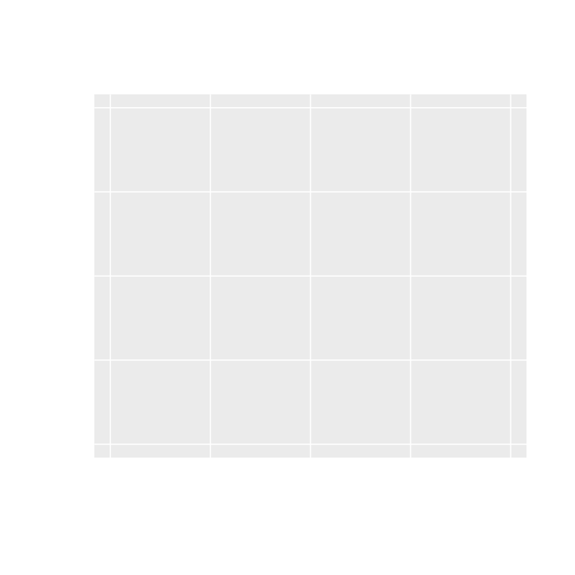

And also add a text:

    plot0(c(-10,10), asp=1, fill=8, text='cool', srt=45, cex=4, col=2)

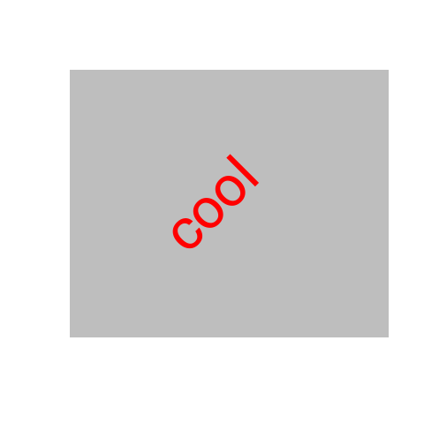

### Add a box

The `box2()` function allows the user to add any axes around the plot in
a more flexible way.

    par(mar=rep(2,4))
    plot0()
    box2(which="figure", lwd=2, fill="grey30")
    box2(side=12, lwd=2, fill="grey80")
    axis(1)
    axis(2)

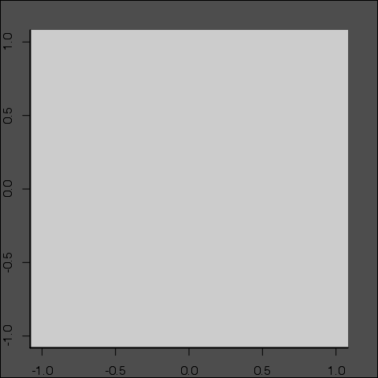

### Encircle points

    coords <- cbind(runif(10), runif(10))
    plot0(coords)
    points(coords, bg="grey25", pch=21)
    encircle(coords, border="#7b11a1", lwd=2)

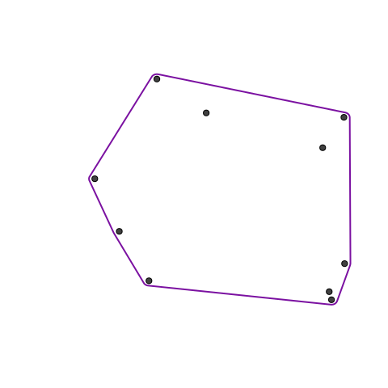

### Add an image

The `pchImage()` function eases the uses of `rasterImage()` to add
images (including png and jpeg files) on a graph. It allows to change
the color of the whole image.

    pathLogo <- system.file("img", "Rlogo.png", package="png")
    par(mar=c(4,1,4,1), mfrow=c(1,2))
    plot0()
    pchImage(0, 0, file=pathLogo, cex.x =4.5, cex.y=4)
    plot0()
    pchImage(0, 0, file=pathLogo, cex.x =4.5, cex.y=4, col="grey25", angle=25)

### A stacked areas chart

#### A simple stacked areas

    plot0(c(0, 10),c(0, 10))
    sz <- 100
    seqx <- seq(0, 10, length.out=sz)
    seqy1 <- 0.2*seqx*runif(sz, 0, 1)
    seqy2 <- 4+0.25*seqx*runif(sz, 0, 1)
    seqy3 <- 8+0.25*seqx*runif(sz, 0, 1)
    envelop(seqx, seqy1, seqy2, col="grey85", border=NA)

#### A complete stacked areas

    x <- data.frame(matrix(runif(200, 2, 10), 8, 25))
    stackedAreas(x)

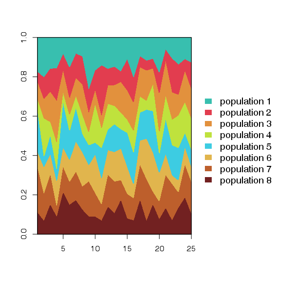

### Polar plot

    polarPlot(1:40, stats::runif(40), to=1.9*pi, col="grey30", border="grey80")

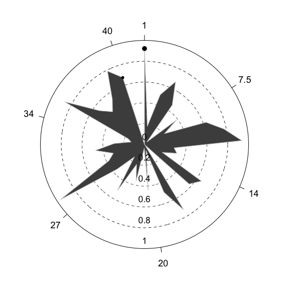

### Get pretty ranges

    vec <- stats::runif(20)
    range(vec)
    R>>  [1] 0.04354205 0.94891618
    prettyRange(vec)
    R>>  [1] 0.00 0.95
    prettyRange(c(3.85, 3.88245))
    R>>  [1] 3.850 3.885

### Interactive functions

Some functions are interactive and fairly understandable! So, I suggest
you try the following functions:

    pickColors()

    layout2()

### Colors

`darken()` and `lighten()` functions are convenient way to produce
consistent set of shaded colors with minimal effort; also use
`showPalette()` to display your palette.

    someblue <- darken("blue", 10*1:9)
    showPalette(someblue)

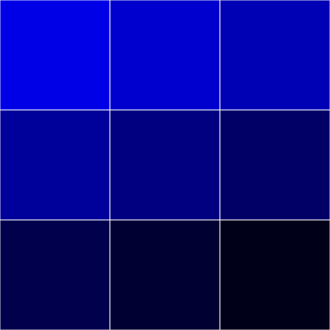

    somered <- lighten("red", 10*1:9)
    showPalette(somered, add_codecolor=TRUE)

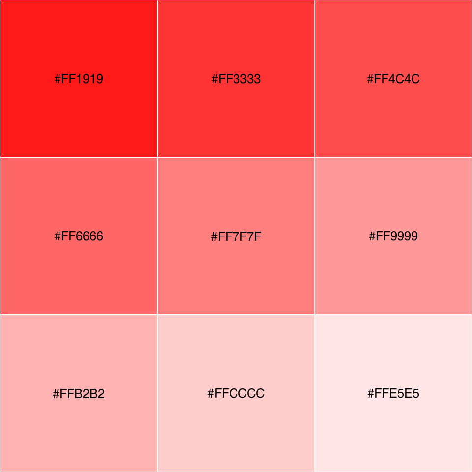

Since version 1.1-2 a set of color palettes has been added, see
`gpuPalette()`.

    showPalette(gpuPalette("insileco"), add_codecolor=TRUE)

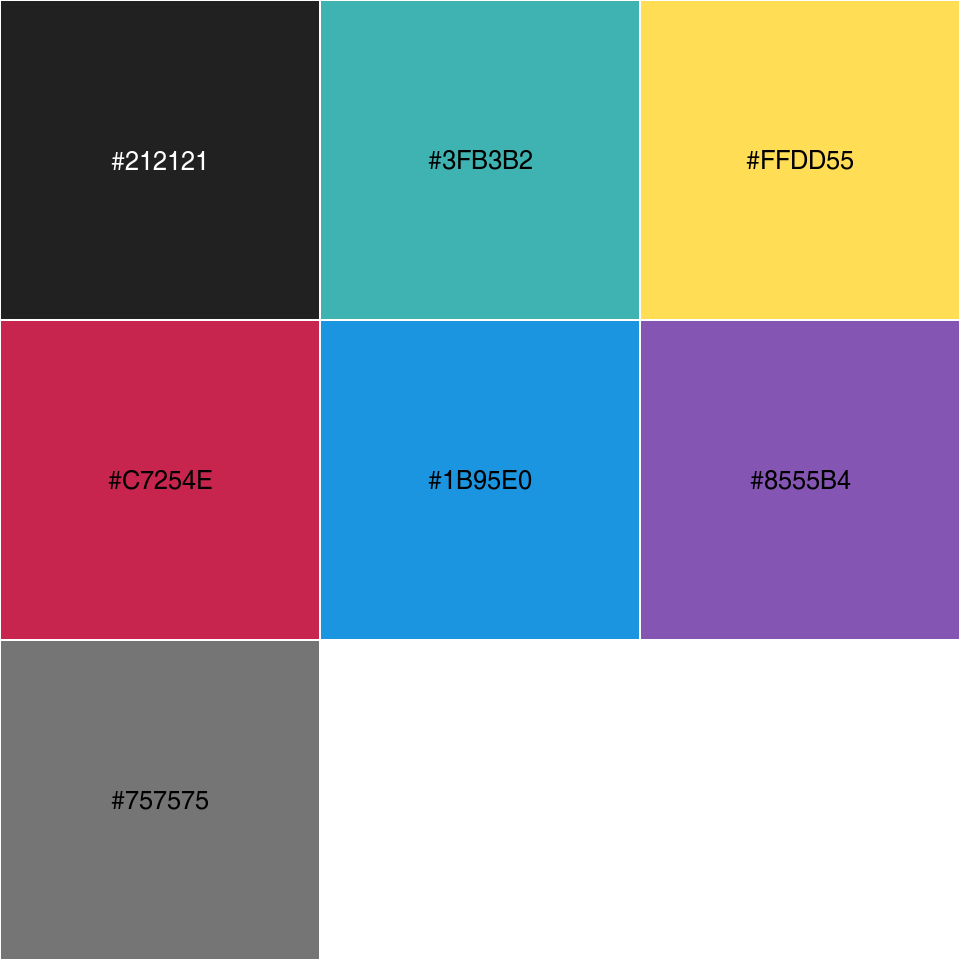

Image 2
-------

    image2(matrix(1:9, 3))

    image2(matrix(1:27, 3), from=2, border = 2, lwd=2)

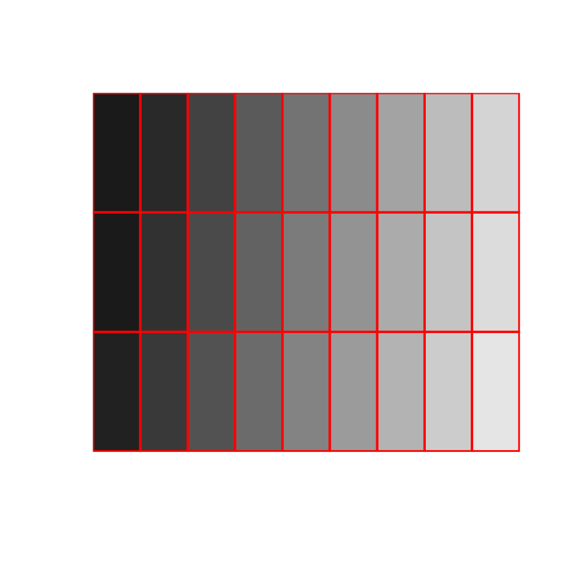

Vector fields
-------------

    systLin <- function(X, beta){
        Y <- matrix(0,ncol=2)
        Y[1L] <- beta[1,1]*X[1L]+beta[1,2]*X[2L]
        Y[2L] <- beta[2,1]*X[1L]+beta[2,2]*X[2L]
        return(Y)
    }
    seqx <- seq(-2,2,0.31)
    seqy <- seq(-2,2,0.31)
    beta1 <- matrix(c(0,-1,1,0),2)
    # Plot 1:
    vecfield2d(coords=expand.grid(seqx, seqy), FUN=systLin, args=list(beta=beta1))

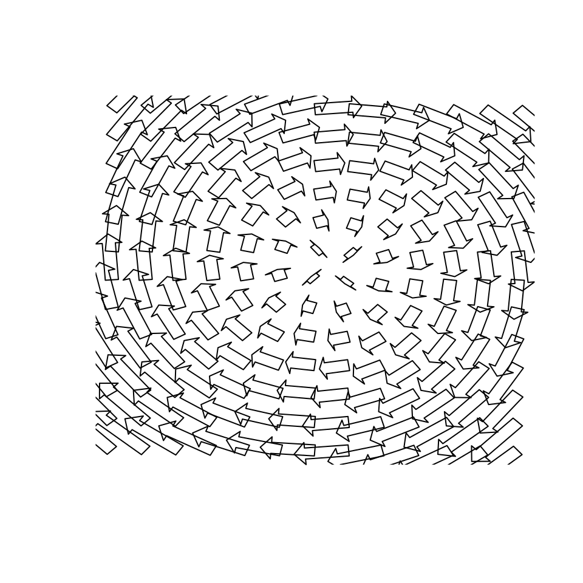

    # # Plot 2:
    graphics::par(mar=c(2,2,2,2))
    vecfield2d(coords=expand.grid(seqx, seqy), FUN=systLin,
       args=list(beta=beta1), cex.x=0.35, cex.arr=0.25,
       border=NA,cex.hh=1, cex.shr=0.6, col=8)
    graphics::abline(v=0, h=0)

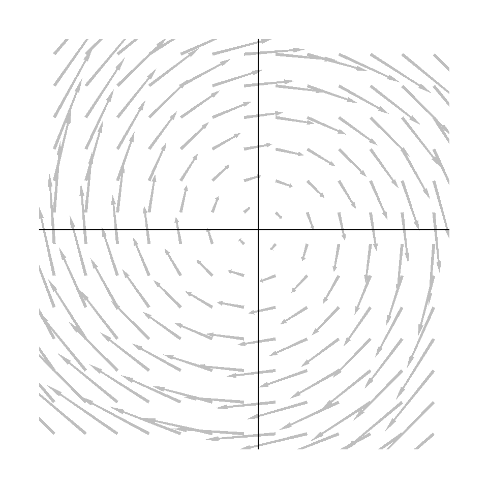

Code of Conduct
---------------

Please note that this project is released with a [Contributor Code of
Conduct](CONDUCT.md). By participating in this project you agree to
abide by its terms.
